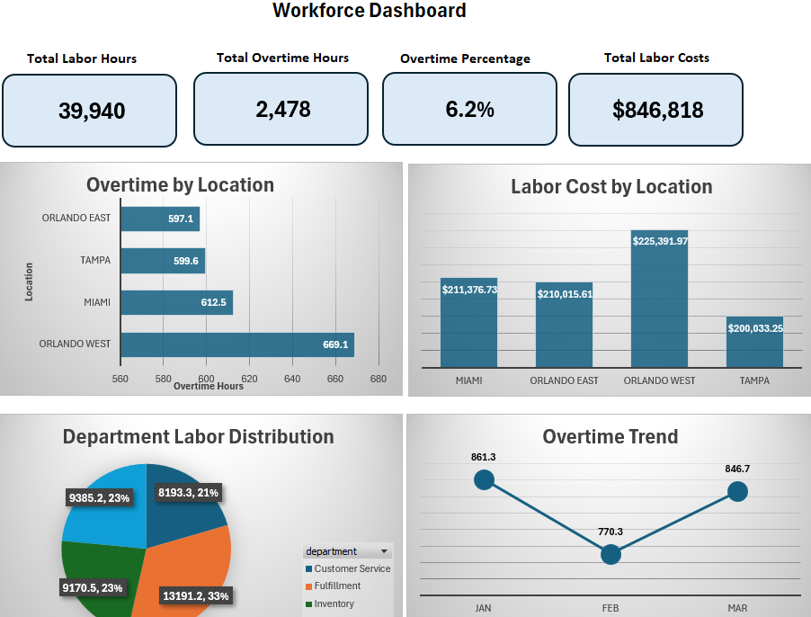

# Workforce Scheduling & Overtime Analysis (Excel)

## Dashboard Preview

## Project Overview

This project analyzes workforce scheduling and payroll data to evaluate labor utilization, overtime trends, and cost drivers across multiple locations.

The goal was to simulate a real-world operations analytics scenario and build an Excel-based dashboard that supports workforce planning and decision-making.

---

## Business Problem

Operations leaders need visibility into:

- Overtime usage across locations  
- Labor cost distribution  
- Department-level workforce utilization  
- Overall workforce efficiency  

High overtime can indicate:

- Understaffing  
- Inefficient scheduling  
- Increased labor costs  

---

## Dataset

Synthetic workforce data generated using Mockaroo.

Includes:

- Employee data (department, location, pay rate)  
- Shift-level data (hours worked, overtime hours, shift type)  
- Multi-location workforce structure  

---

## Data Preparation

Performed in Excel:

- Joined employee pay rates to shift data using XLOOKUP  
- Validated employee IDs across datasets  
- Created calculated payroll fields:
  - Regular pay  
  - Overtime pay (1.5x multiplier)  
  - Total labor cost  

---

## Analysis Performed

- Total labor hours and overtime hours  
- Overtime percentage calculation  
- Labor cost by location  
- Workforce distribution by department  
- Overtime trends over time  

---

## Dashboard Features

- KPI summary (labor hours, overtime %, total cost)  
- Overtime by location  
- Labor cost by location  
- Department labor distribution  
- Overtime trend visualization  

---

## Key Insights

- Certain locations generated a disproportionate share of overtime  
- Customer-facing departments accounted for the largest share of labor hours  
- Overtime increased during peak periods  
- Labor cost concentration identified key cost-driving locations  

---

## Tools Used

- Excel (Pivot Tables, XLOOKUP, Calculations)  
- Mockaroo (data generation)
